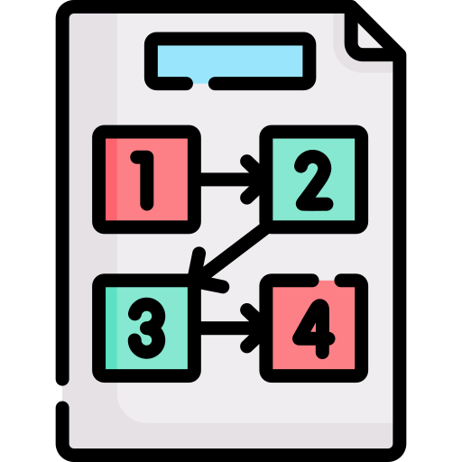

<div align="center">
  
</div>

[](http://commitizen.github.io/cz-cli/)

# An interpreter in Zig

An interpreter, created as a learning playground for both [Zig](https://ziglang.org/) and interpreter.

The interpreter does the process of tokenization, parses source-code in a [REPL](https://en.wikipedia.org/wiki/Read%E2%80%93eval%E2%80%93print_loop), transforms the input into a [AST](https://en.wikipedia.org/wiki/Abstract_syntax_tree), and evaluates the tree.

## Build executable

To build an executable, run the following cmd:

```zsh
zig build-exe src/main.zig -O ReleaseSafe --name bin
```

It'll generate `bin`, which you'd want to execute by:

```
./bin
```

## References

[Lexical analysis](https://en.wikipedia.org/wiki/Lexical_analysis)

[Abstract Syntax tree](https://en.wikipedia.org/wiki/Abstract_syntax_tree)

[Parsing](https://en.wikipedia.org/wiki/Parsing)

[Top-down parsing](https://en.wikipedia.org/wiki/Top-down_parsing)

[Zig documentation](https://ziglang.org/documentation/master)


## Logo

<div>Repository icon made by <a href="https://www.freepik.com" title="Freepik">Freepik</a> from <a href="https://www.flaticon.com/" title="Flaticon">www.flaticon.com</a></div>